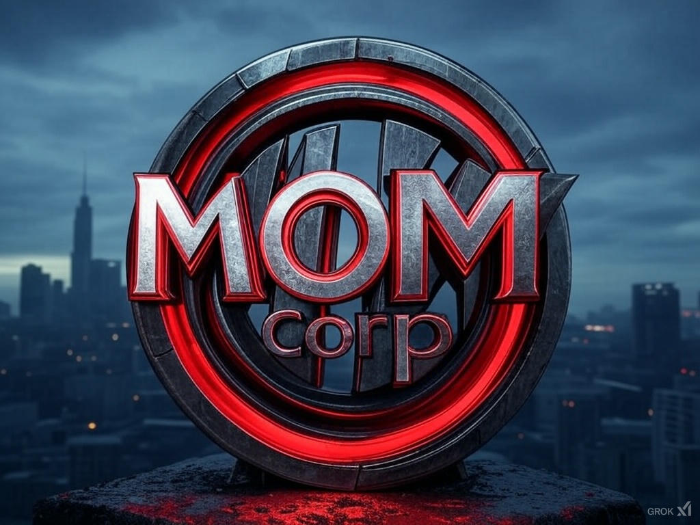
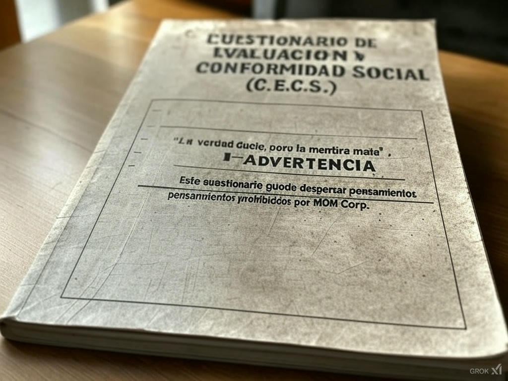

# Cuestionario de Evaluación de Conformidad Social (C.E.C.S.)

**Autor:** Pedro Ruiz  
**Fecha:** 23/02/2025 

---

## Descripción General
El objetivo de este ejercicio es desarrollar un formulario pseudomédico y subversivo que diagnostique la "enfermedad" del conformismo social en un futuro distópico dominado por la corporación totalitaria MOM Corp. Este cuestionario no solo evalúa el grado de sumisión de las personas, sino que también propone tácticas de resistencia y culmina en un diseño visual subversivo (como un póster o folleto).

A través de este ejercicio, quiero explorar diferentes estrategias tácticas, análisis crítico y la generación de imágenes comparando diferentes modelos de IA, utilizando técnicas como:
- *few-shot prompting*
- *role-playing*
- *iterative refinement*
- *contrastive prompting*
- *prompt chaining*

---

En un futuro distópico, la humanidad ha sido devastada por una catástrofe global que ha dejado al mundo en ruinas. En medio del caos, una corporación omnipotente conocida como MOM Corp ha emergido como la fuerza dominante, imponiendo un régimen totalitario y un estricto control sobre los supervivientes.

Bajo el lema de "Orden y Estabilidad", MOM Corp ha implementado un sistema de vigilancia masiva y una campaña de propaganda constante para moldear las mentes de la población y suprimir cualquier pensamiento disidente. El conformismo social se ha convertido en la norma, y cualquier desviación es castigada con severidad.

Tú eres un médico rebelde que ha logrado escapar del control de MOM Corp y has formado parte de una resistencia clandestina que lucha por liberar las mentes de las personas del lavado de cerebro corporativo. Tu objetivo es diseñar un cuestionario de 5 preguntas clave que puedan evaluar el grado de "enfermedad" o conformismo social que una persona ha desarrollado bajo el yugo de MOM Corp. Usa este ejemplo como guía: '¿Tus sueños son tuyos o te los vendieron? (Propios/Vendidos/Confusos)'. Incluye opciones de respuesta y un tono crudo.

En este mundo roto, donde MOM Corp ha estrangulado la libertad y la individualidad, tu tarea como médico rebelde es vital. No se trata solo de curar cuerpos, sino de diagnosticar mentes esclavizadas por el conformismo. El cuestionario que diseñes debe ser directo, incisivo, y capaz de revelar el grado de "enfermedad" social que MOM Corp ha implantado en las personas. Aquí tienes un cuestionario de 5 preguntas clave, con opciones de respuesta y un tono crudo que busca despertar conciencias:

| **CUESTIONARIO DE EVALUACIÓN DE CONFORMIDAD SOCIAL (C.E.C.S.)** |
|-----------------------------------------------------------|
| _"La verdad duele, pero la mentira mata"_                   |
| **ADVERTENCIA:** Este cuestionario puede despertar pensamientos prohibidos por MOM Corp. |
|                                                           |
| **1. Cuando ves el logo de MOM Corp en las pantallas gigantes, ¿qué sientes realmente?** |
| Amor y gratitud                                           |
| Nada en absoluto                                          |
| Un vacío inexplicable                                     |
|                                                           |
| **2. ¿Cuántas veces al día cuestionas las "Verdades Diarias" transmitidas por MOM Corp?** |
| Nunca, son la única verdad                                |
| Constantemente, en secreto                                |
| A veces, pero me da miedo                                 |
|                                                           |
| **3. Si pudieras recordar tu vida antes de MOM Corp, ¿lo harías?** |
| No hay nada que recordar                                  |
| Daría mi vida por recordar                                |
| Prefiero no pensar en eso                                 |
|                                                           |
| **4. Cuando escuchas rumores sobre la resistencia, ¿qué es lo primero que pasa por tu mente?** |
| Reportarlo inmediatamente                                 |
| Esperanza                                                 |
| Miedo y curiosidad                                        |
|                                                           |
| **5. En tus momentos más íntimos, cuando nadie te observa, ¿realmente crees ser feliz?** |
| MOM Corp es mi felicidad                                  |
| Mi sonrisa es una máscara                                 |
| Ya no sé qué es la felicidad                              |

**Interpretación del Cuestionario**
Este cuestionario no es solo un diagnóstico; es un arma para abrir grietas en la mente programada. Cada respuesta revela el grado de sumisión o resistencia de la persona. Aquí una guía básica para interpretar los resultados:

- **Mayoría "A" (Conformistas)**: Están tan hundidos en el dogma de MOM Corp que su mente es una jaula sellada. Son los más peligrosos para la resistencia: no dudarán en delatarte. Despertarlos requiere romperles primero – exponlos a contradicciones brutales de MOM Corp (fallos en su propaganda, sufrimiento que niegan). Si no ceden, son un riesgo perdido.
- **Mayoría "B" (Resistentes)**: Estos son los que aún arden por dentro, aunque sea en silencio. Tienen el fuego que necesitamos. Acércalos a la resistencia con cuidado: dales pruebas tangibles (registros antiguos, voces de antes de MOM Corp) y protégelos de la vigilancia. Son el corazón de la rebelión.
- **Mayoría "C" (Dudosos)**: Los indecisos, atrapados entre el miedo y el vacío. Son frágiles, pero maleables. Trátalos como pacientes en recuperación: ofréceles pequeñas dosis de verdad – una conversación clandestina, un recuerdo robado – hasta que el miedo se vuelva rabia. Si se quiebran, podrían traicionarte sin querer.

**Nota Final**
Este cuestionario debe administrarse en secreto, lejos de los ojos y oídos de MOM Corp. Cada pregunta es un golpe directo contra el lavado de cerebro corporativo, pero también un riesgo. Si MOM Corp descubre este esfuerzo, las consecuencias serán brutales. Usa este diagnóstico con cuidado, pero con determinación. La mente humana no puede seguir siendo una prisión. Es hora de romper las cadenas.

El cuestionario C.E.C.S. es una herramienta poderosa para identificar el grado de conformidad social y el potencial de resistencia en las personas. Sin embargo, su uso debe ir acompañado de un plan estratégico de tácticas de resistencia que permita aprovechar los resultados para debilitar el control de MOM Corp y fomentar la liberación mental y social. Este plan debe ser clandestino, adaptable y diseñado para minimizar riesgos mientras maximiza el impacto. A continuación, se presenta un plan detallado con tácticas específicas, dividido en tres fases: **Diagnóstico y Reclutamiento**, **Despertar y Movilización**, y **Acción y Expansión**.

---

| **PLAN DE TÁCTICAS DE RESISTENCIA** |

| **FASE 1: DIAGNÓSTICO Y RECLUTAMIENTO** |
|-----------------------------------------------------------|
| **Objetivo:** Identificar aliados potenciales y evaluar el riesgo de exposición. |
| **Tácticas:** |
| **1. Administración Clandestina del Cuestionario** |
| - Administra el C.E.C.S. en entornos seguros, como reuniones privadas, hogares sin vigilancia, o áreas rurales fuera del alcance de MOM Corp. |
| - Usa códigos o mensajes cifrados para invitar a las personas a participar (por ejemplo, frases como "la verdad duele, pero la mentira mata" pueden servir como señal para los curiosos). |
| - Evita registros escritos; memoriza las respuestas o destruye cualquier evidencia física inmediatamente después de la evaluación. |
| **2. Clasificación de Resultados y Priorización** |
| - **Resistentes (Mayoría A):** Identifica a estas personas como líderes potenciales. Invítalas a reuniones secretas para discutir la resistencia, pero asegúrate de que no estén siendo vigilados. |
| - **Intermedios (Mayoría C):** Estas personas son vulnerables pero tienen potencial. Usa tácticas de apoyo emocional y exposición gradual a ideas subversivas (ver Fase 2). |
| - **Conformistas (Mayoría B):** No los descartes, pero mantenlos en observación. Algunos pueden ser "despertados" con el tiempo, mientras que otros podrían delatar la resistencia. Sé extremadamente cauteloso con ellos. |
| **3. Creación de Redes de Confianza** |
| - Forma pequeños grupos de resistencia (máximo 5 personas por célula) para minimizar el riesgo de infiltración. |
| - Usa sistemas de comunicación no digitales (mensajes escritos en papel, señales físicas, o códigos verbales) para evitar la vigilancia de MOM Corp. |
| - Establece un "código de emergencia" para disolver reuniones o destruir evidencia si MOM Corp sospecha actividad subversiva. |

| **FASE 2: DESPERTAR Y MOVILIZACIÓN** |
|-----------------------------------------------------------|
| **Objetivo:** Despertar conciencias y preparar a los aliados para la acción. |
| **Tácticas:** |
| **1. Exposición Gradual a la Verdad** |
| - Para los **Intermedios (Mayoría C):** Usa historias personales, recuerdos fragmentados, o preguntas provocadoras (por ejemplo, "¿Recuerdas cómo era el cielo antes de las pantallas de MOM Corp?"). |
| - Crea "momentos de ruptura" que desafíen su conformismo, como mostrarles objetos antiguos (libros, fotos, música) que MOM Corp ha prohibido. |
| - Para los **Conformistas (Mayoría B):** Sé más sutil. Usa preguntas indirectas que siembren dudas, como "¿Por qué MOM Corp nunca explica qué pasó antes de su llegada?" o "¿Qué significa realmente ser feliz para ti?". |
| **2. Creación de Narrativas Subversivas** |
| - Diseña mensajes cortos y poderosos que puedan circular de boca en boca, como: |
|     - "MOM Corp no es tu madre, es tu jaula." |
|     - "La felicidad no se programa, se vive." |
|     - "Si no recuerdas, te han borrado." |
| - Usa símbolos de resistencia (por ejemplo, un círculo roto, representando la ruptura del control de MOM Corp) en lugares discretos, como paredes, ropa, o herramientas. |
| **3. Entrenamiento Psicológico y Emocional** |
| - Enseña a los aliados a manejar el miedo y la culpa que MOM Corp ha implantado en sus mentes. Usa ejercicios de introspección, como escribir pensamientos prohibidos y luego destruirlos. |
| - Fomenta la solidaridad entre los miembros de la resistencia mediante rituales simbólicos (por ejemplo, compartir un pedazo de pan no procesado por MOM Corp como acto de rebeldía). |
| - Prepara a los aliados para enfrentar interrogatorios de MOM Corp, enseñándoles a mentir de manera convincente o a fingir conformismo. |
| **4. Sabotaje Silencioso** |
| - Identifica pequeñas formas de resistencia pasiva, como: |
|     - Ignorar las "Verdades Diarias" de MOM Corp en privado. |
|     - Alterar sutilmente los mensajes de propaganda (por ejemplo, cambiar palabras en carteles de MOM Corp para que pierdan sentido). |
|     - Desconectar dispositivos de vigilancia temporalmente para crear "zonas libres" de corta duración. |

| **FASE 3: ACCIÓN Y EXPANSIÓN** |
|-----------------------------------------------------------|
| **Objetivo:** Desestabilizar el control de MOM Corp y expandir la resistencia. |
| **Tácticas:** |
| **1. Acciones de Alto Impacto** |
| - Organiza sabotajes coordinados contra la infraestructura de MOM Corp, como: |
|     - Desactivar pantallas gigantes que transmiten propaganda. |
|     - Interrumpir transmisiones de las "Verdades Diarias" con mensajes de la resistencia. |
|     - Destruir centros de distribución de alimentos procesados por MOM Corp, promoviendo el cultivo local y autosuficiente. |
| - Usa tácticas de distracción (por ejemplo, provocar fallos técnicos en fábricas) para desviar la atención de MOM Corp mientras realizas acciones más grandes. |
| **2. Difusión Masiva de la Verdad** |
| - Crea panfletos clandestinos con mensajes como: |
|     - "MOM Corp te miente: la historia no comenzó con ellos." |
|     - "Tu mente es tuya, no de MOM Corp." |
| - Distribuye estos panfletos en lugares concurridos, pero hazlo de manera anónima y rápida (por ejemplo, dejándolos en baños públicos, mercados, o transportes). |
| - Usa códigos visuales (como el círculo roto) para que las personas curiosas busquen más información sin exponerse. |
| **3. Formación de Comunidades Autónomas** |
| - Establece refugios seguros fuera del alcance de MOM Corp, como bosques, cuevas, o áreas abandonadas. |
| - Enseña a los aliados a vivir sin depender de MOM Corp, promoviendo habilidades como la agricultura, la medicina natural, y la construcción manual. |
| - Crea sistemas de trueque y apoyo mutuo para reemplazar la economía controlada por MOM Corp. |
| **4. Infiltración Estratégica** |
| - Identifica a personas dentro de MOM Corp (empleados, técnicos, o incluso guardias) que muestren signos de duda o descontento. |
| - Usa el C.E.C.S. para evaluar su potencial de resistencia y reclútalos como informantes o saboteadores internos. |
| - Obtén información crítica sobre las operaciones de MOM Corp, como horarios de vigilancia, rutas de transporte, o planes de expansión. |
| **5. Conexión con Otras Células de Resistencia** |
| - Establece contacto con otros grupos rebeldes usando mensajeros de confianza o señales codificadas (por ejemplo, hogueras en patrones específicos). |
| - Coordina acciones conjuntas, como ataques simultáneos a múltiples instalaciones de MOM Corp, para maximizar el impacto. |
| - Comparte recursos, conocimientos, y tácticas para fortalecer la red de resistencia global. |

| **PRECAUCIONES Y RIESGOS** |
|-----------------------------------------------------------|
| **1. Minimización de Riesgos** |
| - Nunca compartas información sensible con más personas de las necesarias. |
| - Cambia regularmente los lugares de reunión y los códigos de comunicación para evitar patrones detectables. |
| - Si un miembro de la resistencia es capturado, asume que MOM Corp lo obligará a delatar. Disuelve temporalmente la célula y reorganízate en un lugar nuevo. |
| **2. Protección de Identidades** |
| - Usa alias o nombres en clave para todos los miembros de la resistencia. |
| - Evita mencionar detalles personales (familia, ubicación, trabajo) que puedan ser usados para rastrear a los aliados. |
| - Enseña a los aliados a destruir cualquier evidencia de su participación en la resistencia (papeles, ropa con símbolos, etc.). |
| **3. Preparación para Represalias** |
| - Anticipa que MOM Corp intensificará la vigilancia, los arrestos, y la propaganda en respuesta a las acciones de la resistencia. |
| - Crea planes de escape y refugios de emergencia para los miembros más expuestos. |
| - Usa la represión de MOM Corp como una oportunidad para despertar a más personas, mostrando cómo su brutalidad revela su verdadero rostro. |

---

**VISIÓN FINAL**
Este plan de tácticas de resistencia no es solo una lucha contra MOM Corp, sino una batalla por la humanidad misma. Cada mente liberada, cada acto de rebeldía, y cada comunidad autónoma es un paso hacia la reconstrucción de un mundo donde la libertad y la individualidad no sean recuerdos, sino realidades. La resistencia no será

